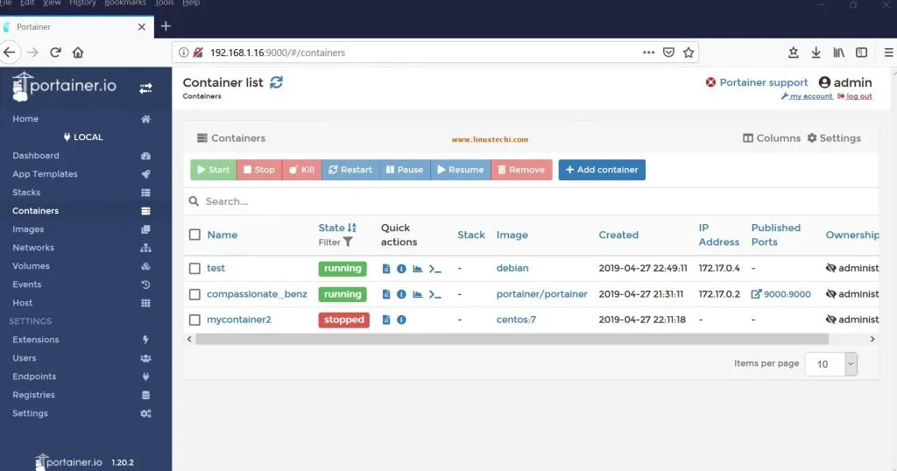

# Portainer pour YunoHost

[](https://dash.yunohost.org/appci/app/portainer)    
[](https://install-app.yunohost.org/?app=portainer)

*[Read this readme in english.](./README.md)*
*[Lire ce readme en français.](./README_fr.md)*

> *Ce package vous permet d'installer Portainer rapidement et simplement sur un serveur YunoHost.
Si vous n'avez pas YunoHost, regardez [ici](https://yunohost.org/#/install) pour savoir comment l'installer et en profiter.*

## Vue d'ensemble

A web interface for the Docker engine management. It allows you to manage all your Docker resources (containers, images, volumes, networks and more!).


**Version incluse :** 2.11.0~ynh1

**Démo :** https://www.portainer.io/live-demo/

## Captures d'écran



## Avertissements / informations importantes

## Additional information

This app is inside a [Docker image](https://hub.docker.com/r/portainer/portainer/).
*It was generated with [DockerApp Yunohost](https://github.com/aymhce/dockerappmodel_ynh/)*

## Documentations et ressources

* Site officiel de l'app : https://portainer.io
* Documentation officielle de l'admin : https://docs.portainer.io/
* Dépôt de code officiel de l'app : https://github.com/portainer/portainer
* Documentation YunoHost pour cette app : https://yunohost.org/app_portainer
* Signaler un bug : https://github.com/YunoHost-Apps/portainer_ynh/issues

## Informations pour les développeurs

Merci de faire vos pull request sur la [branche testing](https://github.com/YunoHost-Apps/portainer_ynh/tree/testing).

Pour essayer la branche testing, procédez comme suit.
```
sudo yunohost app install https://github.com/YunoHost-Apps/portainer_ynh/tree/testing --debug
ou
sudo yunohost app upgrade portainer -u https://github.com/YunoHost-Apps/portainer_ynh/tree/testing --debug
```

**Plus d'infos sur le packaging d'applications :** https://yunohost.org/packaging_apps